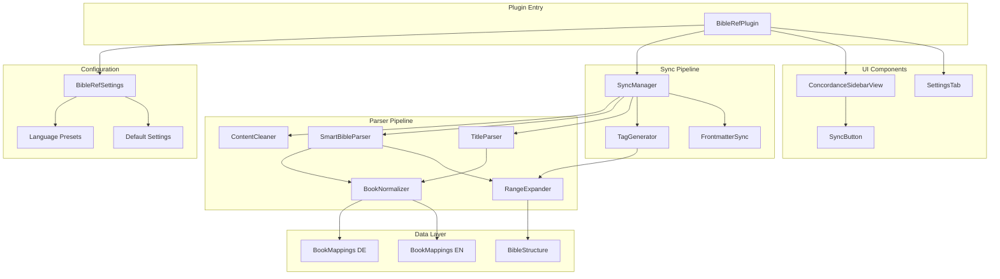
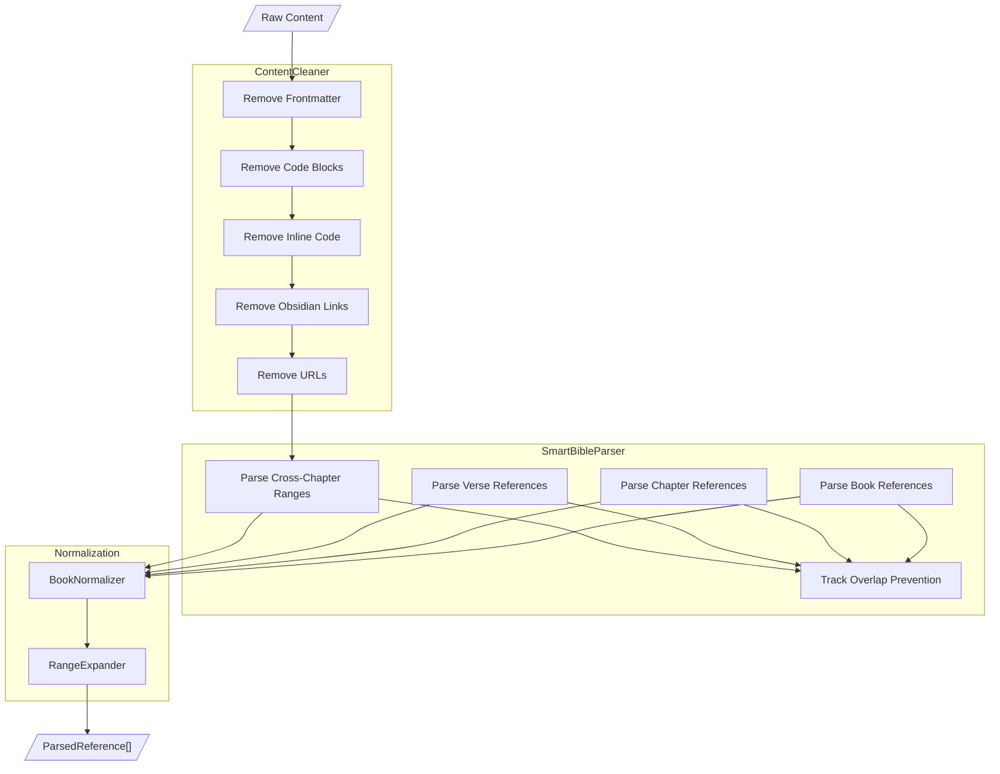
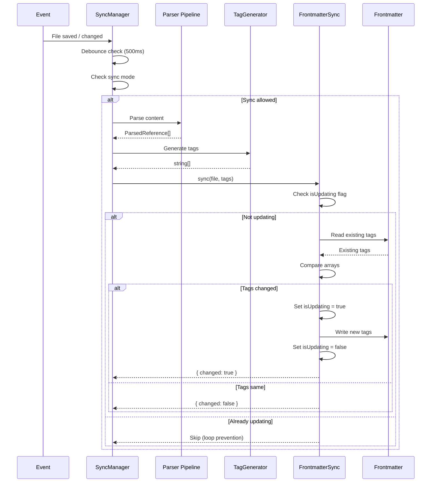
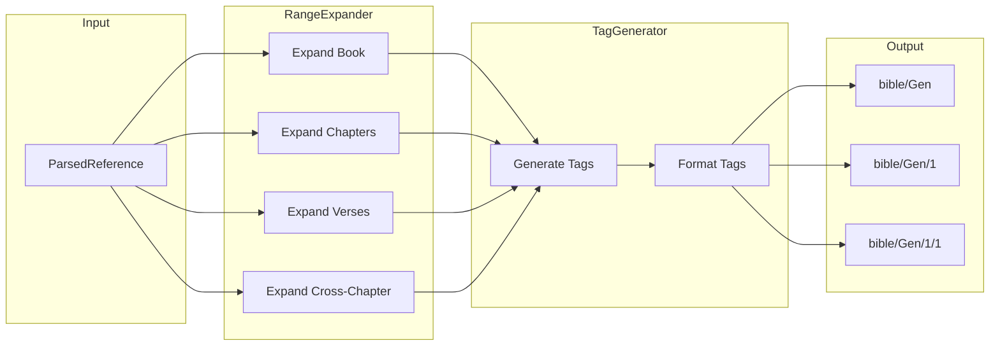
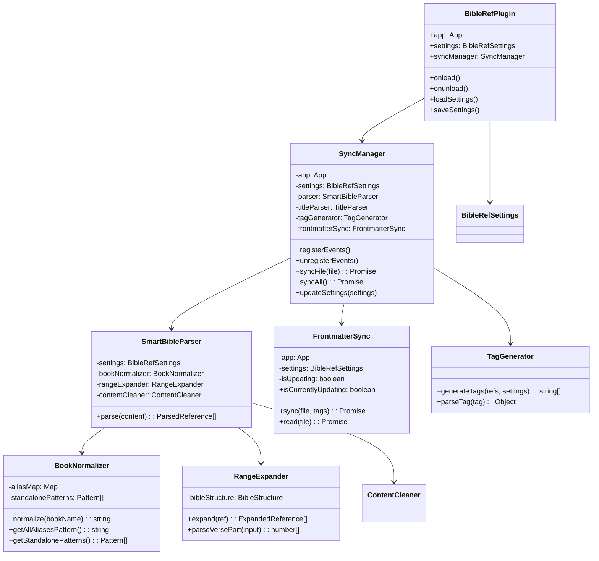
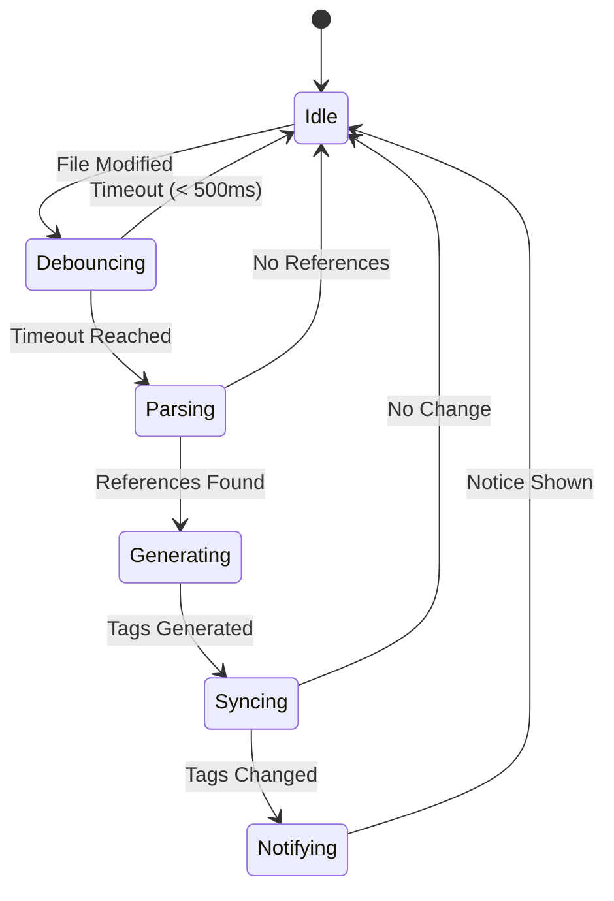

# API Reference

Complete API documentation for the Bible Reference Mapper plugin.

---

## Table of Contents

- [Architecture Diagrams](#architecture-diagrams)
- [Parser API](#parser-api)
- [Sync API](#sync-api)
- [Settings API](#settings-api)
- [Data Structures](#data-structures)
- [Obsidian Integration](#obsidian-integration)
- [Events](#events)

---

## Architecture Diagrams

### System Overview



### Parser Flow



### Sync Flow



### Tag Generation



### Component Relationships



---

## Parser API

### SmartBibleParser

Main class for detecting Bible references in text.

```typescript
class SmartBibleParser {
  constructor(settings: BibleRefSettings);

  /**
   * Parse content and extract all Bible references
   * @param content - Raw text content to parse
   * @returns Array of parsed references
   */
  parse(content: string): ParsedReference[];

  /**
   * Update parser with new settings
   * @param settings - New settings to apply
   */
  updateSettings(settings: BibleRefSettings): void;
}
```

**Usage Example**:
```typescript
const parser = createSmartBibleParser(settings);
const references = parser.parse('Siehe Joh 3,16-18 und Gen 1,1');
// Returns:
// [
//   { raw: 'Joh 3,16-18', bookId: 'Joh', granularity: 'verse', startChapter: 3, startVerse: 16, endVerse: 18 },
//   { raw: 'Gen 1,1', bookId: 'Gen', granularity: 'verse', startChapter: 1, startVerse: 1 }
// ]
```

### BookNormalizer

Normalizes book name aliases to canonical IDs.

```typescript
class BookNormalizer {
  constructor(
    language: 'de' | 'en' | 'custom',
    customMappings?: Record<string, string>
  );

  /**
   * Normalize a book name to its canonical ID
   * @param bookName - Input book name (any alias)
   * @returns Canonical book ID or null if not found
   */
  normalize(bookName: string): string | null;

  /**
   * Get regex pattern matching all known aliases
   * @returns Pattern string for use in RegExp
   */
  getAllAliasesPattern(): string;

  /**
   * Get patterns for standalone book names
   * @returns Array of patterns that can match without chapter/verse
   */
  getStandalonePatterns(): { pattern: RegExp; bookId: string }[];
}
```

**Usage Example**:
```typescript
const normalizer = createBookNormalizer('de');
normalizer.normalize('Johannes');    // 'Joh'
normalizer.normalize('1. Mose');     // 'Gen'
normalizer.normalize('Kolosser');    // 'Col'
normalizer.normalize('Unknown');     // null
```

### RangeExpander

Expands parsed references to individual verse references.

```typescript
class RangeExpander {
  /**
   * Expand a parsed reference to atomic verse references
   * @param ref - Parsed reference to expand
   * @returns Array of individual verse references
   */
  expand(ref: ParsedReference): ExpandedReference[];

  /**
   * Parse a verse part string into verse numbers
   * @param input - Verse part string (e.g., "16-18.20")
   * @param listSep - List separator character
   * @param rangeSep - Range separator character
   * @returns Array of verse numbers
   */
  parseVersePart(input: string, listSep: string, rangeSep: string): number[];
}
```

**Usage Example**:
```typescript
const expander = createRangeExpander();

// Parse verse part
expander.parseVersePart('16-18.20', '.', '-');
// Returns: [16, 17, 18, 20]

// Expand reference
const ref: ParsedReference = {
  raw: 'Joh 3,16-18',
  bookId: 'Joh',
  granularity: 'verse',
  startChapter: 3,
  startVerse: 16,
  endVerse: 18
};
expander.expand(ref);
// Returns: [
//   { bookId: 'Joh', chapter: 3, verse: 16 },
//   { bookId: 'Joh', chapter: 3, verse: 17 },
//   { bookId: 'Joh', chapter: 3, verse: 18 }
// ]
```

### ContentCleaner

Removes non-parseable sections from content.

```typescript
class ContentCleaner {
  constructor(settings: BibleRefSettings);

  /**
   * Clean content by removing excluded sections
   * @param content - Raw content
   * @returns Cleaned content with exclusions replaced by spaces
   */
  clean(content: string): string;
}
```

**Excluded Sections**:
- YAML frontmatter (`---...---`)
- Fenced code blocks (` ```...``` `)
- Inline code (`` `...` ``)
- Obsidian links (`[[...]]`)
- URLs (`http://`, `https://`)

### TitleParser

Extracts Bible references from file names.

```typescript
class TitleParser {
  constructor(settings: BibleRefSettings);

  /**
   * Parse a file title for Bible references
   * @param title - File name (with or without .md)
   * @returns Parsed reference or null
   */
  parse(title: string): ParsedReference | null;
}
```

**Usage Example**:
```typescript
const titleParser = createTitleParser(settings);
titleParser.parse('Joh 3,16.md');     // ParsedReference for verse
titleParser.parse('Kolosser.md');     // ParsedReference for book
titleParser.parse('My Notes.md');     // null
```

---

## Sync API

### SyncManager

Orchestrates all sync operations.

```typescript
class SyncManager {
  constructor(app: App, plugin: Plugin, settings: BibleRefSettings);

  /**
   * Register event listeners based on sync mode
   */
  registerEvents(): void;

  /**
   * Unregister all event listeners
   */
  unregisterEvents(): void;

  /**
   * Sync a single file
   * @param file - File to sync
   * @returns Sync result
   */
  syncFile(file: TFile): Promise<{ changed: boolean; tagCount: number }>;

  /**
   * Sync all markdown files in vault
   * @returns Batch sync result
   */
  syncAll(): Promise<{ processed: number; changed: number }>;

  /**
   * Update settings and reinitialize components
   * @param settings - New settings
   */
  updateSettings(settings: BibleRefSettings): void;
}
```

### FrontmatterSync

Handles reading and writing to YAML frontmatter.

```typescript
class FrontmatterSync {
  constructor(app: App, settings: BibleRefSettings);

  /**
   * Sync tags to file frontmatter
   * @param file - Target file
   * @param newTags - Tags to write
   * @returns Whether frontmatter was changed
   */
  sync(file: TFile, newTags: string[]): Promise<{ changed: boolean; tagCount: number }>;

  /**
   * Read existing tags from frontmatter
   * @param file - File to read
   * @returns Array of existing tags
   */
  read(file: TFile): Promise<string[]>;

  /**
   * Clear all Bible reference tags
   * @param file - File to clear
   */
  clear(file: TFile): Promise<void>;

  /**
   * Check if currently updating (for loop prevention)
   */
  get isCurrentlyUpdating(): boolean;
}
```

### TagGenerator

Converts parsed references to tag strings.

```typescript
/**
 * Generate tags from parsed references
 * @param references - Array of parsed references
 * @param settings - Plugin settings
 * @returns Array of tag strings
 */
function generateTags(
  references: ParsedReference[],
  settings: BibleRefSettings
): string[];

/**
 * Parse a tag string back to components
 * @param tag - Tag string (e.g., "bible/Joh/3/16")
 * @returns Parsed components or null
 */
function parseTag(tag: string): {
  bookId: string;
  chapter?: number;
  verse?: number;
} | null;

/**
 * Compare tags by specificity for sorting
 * @returns Comparison result (-1, 0, 1)
 */
function compareTagsBySpecificity(a: string, b: string): number;

/**
 * Group tags by book ID
 * @param tags - Array of tags
 * @returns Map of bookId to tags
 */
function groupTagsByBook(tags: string[]): Map<string, string[]>;
```

---

## Settings API

### BibleRefSettings

```typescript
interface BibleRefSettings {
  /** Sync mode configuration */
  syncMode: 'on-save-or-change' | 'on-save' | 'on-file-change' | 'manual';

  /** Language preset */
  language: 'de' | 'en' | 'custom';

  /** Separator configuration */
  separators: {
    chapterVerse: string;  // "," for German, ":" for English
    list: string;          // "." for German, "," for English
    range: string;         // "-" (universal)
  };

  /** YAML frontmatter key for tags */
  frontmatterKey: string;  // Default: "bible-refs"

  /** Prefix for generated tags */
  tagPrefix: string;       // Default: "bible/"

  /** Custom book name mappings */
  customBookMappings: Record<string, string>;

  /** Parse references inside code blocks */
  parseCodeBlocks: boolean;  // Default: false

  /** Parse file titles for references */
  parseTitles: boolean;      // Default: true
}
```

### Default Settings

```typescript
const DEFAULT_SETTINGS: BibleRefSettings = {
  syncMode: 'on-save-or-change',
  language: 'de',
  separators: {
    chapterVerse: ',',
    list: '.',
    range: '-'
  },
  frontmatterKey: 'bible-refs',
  tagPrefix: 'bible/',
  customBookMappings: {},
  parseCodeBlocks: false,
  parseTitles: true
};
```

### Language Presets

```typescript
const LANGUAGE_PRESETS: Record<string, SeparatorConfig> = {
  de: { chapterVerse: ',', list: '.', range: '-' },
  en: { chapterVerse: ':', list: ',', range: '-' }
};
```

---

## Data Structures

### ParsedReference

```typescript
interface ParsedReference {
  /** Original matched string */
  raw: string;

  /** Canonical book ID (e.g., "Joh", "Gen") */
  bookId: string;

  /** Reference granularity */
  granularity: 'book' | 'chapter' | 'verse';

  /** Start chapter (if applicable) */
  startChapter?: number;

  /** Start verse (if applicable) */
  startVerse?: number;

  /** End chapter (for cross-chapter ranges) */
  endChapter?: number;

  /** End verse (if applicable) */
  endVerse?: number;

  /** Internal: parsed verse list for "16.18.20" patterns */
  _verseList?: number[];
}
```

### ExpandedReference

```typescript
interface ExpandedReference {
  /** Canonical book ID */
  bookId: string;

  /** Chapter number */
  chapter: number;

  /** Verse number */
  verse: number;
}
```

### BookData

```typescript
interface BookData {
  /** Number of chapters in the book */
  chapters: number;

  /** Array of verse counts per chapter (0-indexed) */
  versesPerChapter: number[];
}
```

### BookMapping

```typescript
interface BookMapping {
  /** Canonical book ID */
  canonicalId: string;

  /** All recognized aliases for this book */
  aliases: string[];

  /** Patterns that can stand alone (without chapter/verse) */
  standalonePatterns: string[];
}
```

---

## Obsidian Integration

### Plugin Lifecycle

```typescript
class BibleRefPlugin extends Plugin {
  settings: BibleRefSettings;
  syncManager: SyncManager;

  async onload(): Promise<void> {
    // 1. Load settings
    await this.loadSettings();

    // 2. Initialize SyncManager
    this.syncManager = createSyncManager(this.app, this, this.settings);

    // 3. Register events based on sync mode
    this.syncManager.registerEvents();

    // 4. Register sidebar view
    this.registerView(
      VIEW_TYPE_CONCORDANCE,
      (leaf) => new ConcordanceSidebarView(leaf, this)
    );

    // 5. Register commands
    this.addCommand({
      id: 'open-bible-references',
      name: 'Open Bible References',
      callback: () => this.activateSidebarView()
    });

    this.addCommand({
      id: 'sync-current-file',
      name: 'Sync Current File',
      callback: () => this.syncCurrentFile()
    });

    this.addCommand({
      id: 'sync-all-files',
      name: 'Sync All Files',
      callback: () => this.syncManager.syncAll()
    });

    // 6. Register settings tab
    this.addSettingTab(new BibleRefSettingsTab(this.app, this));
  }

  async onunload(): Promise<void> {
    this.syncManager.unregisterEvents();
  }
}
```

### Obsidian API Usage

| API | Usage |
|-----|-------|
| `Plugin` | Base class for plugin |
| `App` | Vault and workspace access |
| `TFile` | File operations |
| `MarkdownView` | Active editor access |
| `WorkspaceLeaf` | Sidebar management |
| `PluginSettingTab` | Settings UI |
| `Setting` | Individual setting controls |
| `Notice` | User notifications |
| `ItemView` | Sidebar views |
| `vault.on('modify')` | File change events |
| `workspace.on('file-open')` | File open events |
| `fileManager.processFrontMatter()` | Frontmatter manipulation |
| `metadataCache.getFileCache()` | Cached file metadata |

---

## Events

### Registered Events

| Event | Trigger | Handler |
|-------|---------|---------|
| `vault:modify` | File content saved | `SyncManager.handleModify` |
| `workspace:file-open` | File opened | `SyncManager.handleFileOpen` |
| `workspace:active-leaf-change` | Active pane changed | `ConcordanceSidebarView.refresh` |
| `editor:change` | Editor content changed | `ConcordanceSidebarView.scheduleRefresh` |

### Event Flow



---

## Utility Functions

### regexUtils.ts

```typescript
/**
 * Escape special regex characters in a string
 * @param str - String to escape
 * @returns Escaped string safe for RegExp
 */
function escapeRegex(str: string): string;

/**
 * Build verse part pattern for matching "16-18.20" style strings
 * @param listSep - List separator
 * @param rangeSep - Range separator
 * @returns Regex pattern string
 */
function buildVersePartPattern(listSep: string, rangeSep: string): string;
```

### bibleStructure.ts Helpers

```typescript
/**
 * Get maximum verse number for a chapter
 * @returns Verse count or null if invalid
 */
function getMaxVerse(bookId: string, chapter: number): number | null;

/**
 * Get maximum chapter number for a book
 * @returns Chapter count or null if invalid
 */
function getMaxChapter(bookId: string): number | null;

/**
 * Get all verse numbers in a chapter
 * @returns Array of verse numbers [1, 2, 3, ...]
 */
function getAllVersesInChapter(bookId: string, chapter: number): number[];

/**
 * Get all chapter numbers in a book
 * @returns Array of chapter numbers [1, 2, 3, ...]
 */
function getAllChaptersInBook(bookId: string): number[];

/**
 * Validate a reference against Bible structure
 * @returns Whether the reference is valid
 */
function isValidReference(bookId: string, chapter: number, verse?: number): boolean;
```

---

## Error Handling

The API follows a principle of **graceful degradation**:

- Invalid references are silently ignored
- Unknown book names return `null` from normalize
- Invalid verse/chapter numbers are skipped during expansion
- Frontmatter sync failures are logged but don't crash

```typescript
// All these return safe fallback values instead of throwing
normalizer.normalize('InvalidBook');  // null
expander.expand(invalidRef);          // []
parser.parse('No references here');   // []
```

---

## Performance Considerations

1. **Debouncing**: 500ms leading-edge debounce on file events
2. **Caching**: Sidebar uses `isDirty` flag to avoid redundant index builds
3. **MetadataCache**: Uses Obsidian's cache instead of reading files
4. **Loop Prevention**: `isUpdating` flag prevents infinite sync loops
5. **Lazy Loading**: Components initialized only when needed

---

*For implementation details, see [DEVELOPER.md](DEVELOPER.md)*
