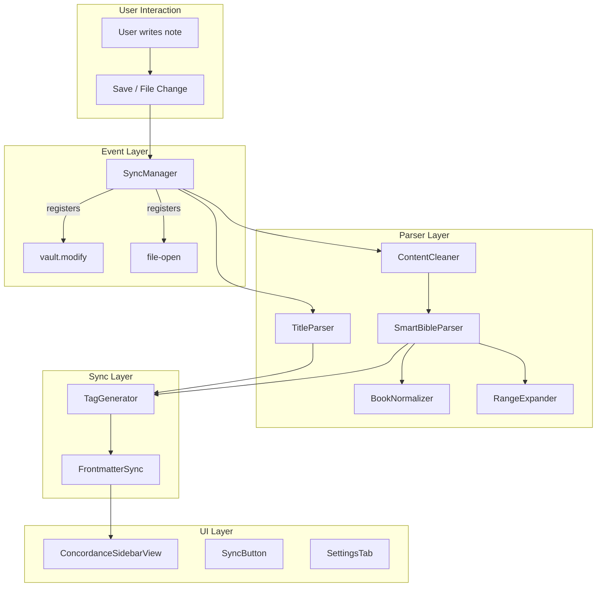
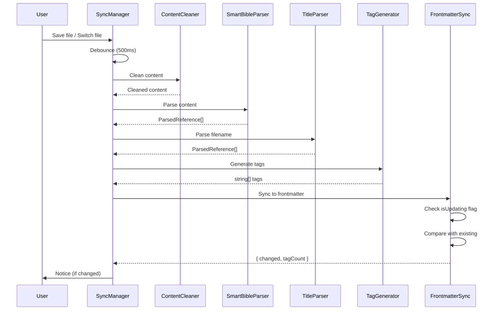

# Developer Documentation

This document provides comprehensive technical documentation for developers who want to understand, modify, or contribute to the Bible Reference Mapper plugin.

---

## Table of Contents

- [Architecture Overview](#architecture-overview)
- [Project Structure](#project-structure)
- [Core Components](#core-components)
- [Data Flow](#data-flow)
- [Type Definitions](#type-definitions)
- [Module Specifications](#module-specifications)
- [Bible Data Structures](#bible-data-structures)
- [Testing](#testing)
- [Development Setup](#development-setup)
- [Coding Standards](#coding-standards)
- [Contributing](#contributing)

---

## Architecture Overview

### Design Principles

| Principle | Description |
|-----------|-------------|
| **Low Friction** | Users write naturally - no special syntax required |
| **Privacy First** | No external API calls - everything runs locally |
| **Lean & Fast** | Minimal footprint, no UI overload |
| **Graph Native** | Integrates with Obsidian's graph through hierarchical tags |

### What This Plugin Does NOT Do

- Import or display Bible text
- Call external services
- Modify note content (except frontmatter)

### High-Level Architecture



---

## Project Structure

```
bible-reference-mapper/
├── manifest.json              # Obsidian plugin manifest
├── package.json               # NPM dependencies
├── tsconfig.json              # TypeScript configuration
├── esbuild.config.mjs         # Build configuration
├── styles.css                 # Sidebar UI styles
│
├── src/
│   ├── main.ts                # Plugin entry point
│   ├── types.ts               # TypeScript interfaces
│   ├── constants.ts           # Plugin-wide constants
│   │
│   ├── settings/
│   │   ├── SettingsTab.ts     # Obsidian PluginSettingTab
│   │   ├── defaultSettings.ts # Default configuration values
│   │   └── presets.ts         # Language presets (DE/EN)
│   │
│   ├── parser/
│   │   ├── SmartBibleParser.ts   # Main reference detection engine
│   │   ├── TitleParser.ts        # Filename parser
│   │   ├── RangeExpander.ts      # Expand ranges to atomic verses
│   │   ├── BookNormalizer.ts     # Alias to canonical ID mapping
│   │   └── ContentCleaner.ts     # Remove non-parseable sections
│   │
│   ├── sync/
│   │   ├── FrontmatterSync.ts    # Frontmatter read/write
│   │   ├── TagGenerator.ts       # Reference to tag conversion
│   │   └── SyncManager.ts        # Event handling & sync modes
│   │
│   ├── sidebar/
│   │   ├── ConcordanceSidebarView.ts  # Main sidebar view
│   │   └── SyncButton.ts              # Reusable sync button
│   │
│   ├── data/
│   │   ├── bibleStructure.ts     # Chapter/verse counts (66 books)
│   │   ├── bookMappings.de.ts    # German book name aliases
│   │   └── bookMappings.en.ts    # English book name aliases
│   │
│   └── utils/
│       └── regexUtils.ts         # Shared regex helpers
│
└── tests/
    ├── parser/
    │   ├── SmartBibleParser.test.ts
    │   ├── RangeExpander.test.ts
    │   ├── BookNormalizer.test.ts
    │   └── TitleParser.test.ts
    └── sync/
        ├── TagGenerator.test.ts
        ├── FrontmatterSync.test.ts
        └── integration.test.ts
```

---

## Core Components

### 1. SmartBibleParser

**Purpose**: Detect Bible references in natural text

**Location**: `src/parser/SmartBibleParser.ts`

**Supported Formats**:
- Single verse: `Joh 3,16` / `John 3:16`
- Verse list: `Joh 3,16.18`
- Verse range: `Joh 3,16-18`
- Mixed: `Joh 3,16-18.20`
- Cross-chapter: `Joh 3,35-4,3`
- Whole chapter: `Joh 3`
- Chapter range: `Joh 3-4`
- Whole book: `Kolosserbrief`
- Numbered books: `1. Mose`, `1Mose`, `2 Kor`

**Critical: Parse Order** (most specific first)
1. Cross-chapter ranges (`Joh 3,16-4,3`)
2. Verse references (`Joh 3,16-18`)
3. Chapter references (`Joh 3`)
4. Book references (`Kolosserbrief`)

```typescript
class SmartBibleParser {
  constructor(settings: BibleRefSettings);
  parse(content: string): ParsedReference[];

  private parseCrossChapterRanges(content: string, matched: Range[]): ParsedReference[];
  private parseVerseReferences(content: string, matched: Range[]): ParsedReference[];
  private parseChapterReferences(content: string, matched: Range[]): ParsedReference[];
  private parseBookReferences(content: string, matched: Range[]): ParsedReference[];
}
```

### 2. BookNormalizer

**Purpose**: Normalize book name aliases to canonical IDs

**Location**: `src/parser/BookNormalizer.ts`

**Key Feature**: Longest-first matching to prevent false positives
- "Johannes" is tried before "Joh"
- Prevents "Joh" from matching inside "Johannes"

```typescript
class BookNormalizer {
  private aliasMap: Map<string, string>;  // "johannes" -> "Joh"

  constructor(language: 'de' | 'en' | 'custom', customMappings?: Record<string, string>);
  normalize(bookName: string): string | null;
  getAllAliasesPattern(): string;  // For regex construction
  getStandalonePatterns(): { pattern: RegExp; bookId: string }[];
}
```

### 3. RangeExpander

**Purpose**: Expand parsed references to atomic verse references

**Location**: `src/parser/RangeExpander.ts`

**Critical Principle: Atomic Tagging**
- Ranges ALWAYS expand to individual verses
- NEVER create `bible/Joh/3/16-18`
- ALWAYS create: `bible/Joh/3/16`, `bible/Joh/3/17`, `bible/Joh/3/18`

```typescript
class RangeExpander {
  expand(ref: ParsedReference): ExpandedReference[];
  parseVersePart(input: string, listSep: string, rangeSep: string): number[];

  private expandBook(bookId: string): ExpandedReference[];
  private expandChapters(ref: ParsedReference): ExpandedReference[];
  private expandVerses(ref: ParsedReference): ExpandedReference[];
  private expandCrossChapterRange(ref: ParsedReference): ExpandedReference[];
}
```

**Cross-Chapter Algorithm** (e.g., `Joh 3,35-4,3`):
1. Add remaining verses in start chapter (3:35 to end of ch3)
2. Add all verses in intermediate chapters (none in this case)
3. Add verses in end chapter (4:1 to 4:3)

### 4. ContentCleaner

**Purpose**: Remove sections that shouldn't be parsed

**Location**: `src/parser/ContentCleaner.ts`

**Sections Removed**:
- YAML frontmatter (`---...---`)
- Fenced code blocks (`` ```...``` ``)
- Inline code (`` `...` ``)
- Obsidian links (`[[...]]`)
- URLs (`http://`, `https://`)

**Design**: Replaces excluded content with spaces to preserve character indices for accurate matching.

```typescript
class ContentCleaner {
  constructor(settings: BibleRefSettings);
  clean(content: string): string;

  private removeFrontmatter(content: string): string;
  private removeCodeBlocks(content: string): string;
  private removeInlineCode(content: string): string;
  private removeObsidianLinks(content: string): string;
  private removeUrls(content: string): string;
}
```

### 5. SyncManager

**Purpose**: Orchestrate all sync operations and event handling

**Location**: `src/sync/SyncManager.ts`

**Sync Modes**:
| Mode | Description |
|------|-------------|
| `on-save-or-change` | Sync on save (Ctrl+S) OR file change |
| `on-save` | Only on explicit save |
| `on-file-change` | Only when switching files |
| `manual` | Only via Command Palette or sidebar |

```typescript
class SyncManager {
  constructor(app: App, plugin: Plugin, settings: BibleRefSettings);

  registerEvents(): void;
  unregisterEvents(): void;

  async syncFile(file: TFile): Promise<{ changed: boolean; tagCount: number }>;
  async syncAll(): Promise<{ processed: number; changed: number }>;

  updateSettings(settings: BibleRefSettings): void;
}
```

**Debouncing**: 500ms leading edge debounce for rapid file changes

### 6. FrontmatterSync

**Purpose**: Read/write Bible reference tags to YAML frontmatter

**Location**: `src/sync/FrontmatterSync.ts`

**Critical: Loop Prevention**

`processFrontMatter()` triggers a 'modify' event. Without prevention, this causes infinite loops.

```typescript
class FrontmatterSync {
  private isUpdating: boolean = false;

  constructor(app: App, settings: BibleRefSettings);

  async sync(file: TFile, newTags: string[]): Promise<{ changed: boolean; tagCount: number }>;
  async read(file: TFile): Promise<string[]>;

  get isCurrentlyUpdating(): boolean;
}
```

**Loop Prevention Pattern**:
```typescript
async sync(file: TFile, newTags: string[]): Promise<boolean> {
  if (this.isUpdating) return false;
  this.isUpdating = true;
  try {
    await this.app.fileManager.processFrontMatter(file, (fm) => {
      // Only write if tags changed
    });
  } finally {
    this.isUpdating = false;
  }
}
```

### 7. TagGenerator

**Purpose**: Convert parsed references to hierarchical tag strings

**Location**: `src/sync/TagGenerator.ts`

**Tag Format**:
```
bible/Col           # Book level
bible/Col/3         # Chapter level
bible/Col/3/16      # Verse level
```

```typescript
// Functions
function generateTags(references: ParsedReference[], settings: BibleRefSettings): string[];
function parseTag(tag: string): { bookId: string; chapter?: number; verse?: number } | null;
function compareTagsBySpecificity(a: string, b: string): number;
function groupTagsByBook(tags: string[]): Map<string, string[]>;
```

---

## Data Flow

### Complete Sync Flow



### Example: Parsing `Joh 3,16-18`

```
Input: "Siehe Joh 3,16-18"
                ↓
ContentCleaner.clean()
                ↓
SmartBibleParser.parse()
  → Match verse pattern: "Joh 3,16-18"
  → BookNormalizer.normalize("Joh") → "Joh"
  → RangeExpander.parseVersePart("16-18") → [16, 17, 18]
                ↓
ParsedReference {
  raw: "Joh 3,16-18",
  bookId: "Joh",
  granularity: "verse",
  startChapter: 3,
  startVerse: 16,
  endVerse: 18
}
                ↓
TagGenerator.generateTags()
  → RangeExpander.expand()
  → ExpandedReference[] [{Joh,3,16}, {Joh,3,17}, {Joh,3,18}]
                ↓
["bible/Joh/3/16", "bible/Joh/3/17", "bible/Joh/3/18"]
                ↓
FrontmatterSync.sync()
```

---

## Type Definitions

All types are defined in `src/types.ts`:

```typescript
// ═══════════════════════════════════════════════════════════════
// SYNC CONFIGURATION
// ═══════════════════════════════════════════════════════════════

export type SyncMode =
  | 'on-save-or-change'
  | 'on-save'
  | 'on-file-change'
  | 'manual';

export interface SeparatorConfig {
  chapterVerse: string;  // "," (DE) or ":" (EN)
  list: string;          // "." (DE) or "," (EN)
  range: string;         // "-" (universal)
}

export interface BibleRefSettings {
  syncMode: SyncMode;
  language: 'de' | 'en' | 'custom';
  separators: SeparatorConfig;
  frontmatterKey: string;
  tagPrefix: string;
  customBookMappings: Record<string, string>;
  parseCodeBlocks: boolean;
  parseTitles: boolean;
}

// ═══════════════════════════════════════════════════════════════
// PARSED REFERENCES
// ═══════════════════════════════════════════════════════════════

export type ReferenceGranularity = 'book' | 'chapter' | 'verse';

export interface ParsedReference {
  raw: string;
  bookId: string;
  granularity: ReferenceGranularity;
  startChapter?: number;
  startVerse?: number;
  endChapter?: number;
  endVerse?: number;
  _verseList?: number[];
}

export interface ExpandedReference {
  bookId: string;
  chapter: number;
  verse: number;
}

// ═══════════════════════════════════════════════════════════════
// BIBLE DATA STRUCTURE
// ═══════════════════════════════════════════════════════════════

export interface BookData {
  chapters: number;
  versesPerChapter: number[];
}

export type BibleStructure = Record<string, BookData>;

export interface BookMapping {
  canonicalId: string;
  aliases: string[];
  standalonePatterns: string[];
}

// ═══════════════════════════════════════════════════════════════
// SIDEBAR DATA
// ═══════════════════════════════════════════════════════════════

export interface RelatedNote {
  file: TFile;
  relevance: 'exact-verse' | 'same-chapter' | 'same-book';
  matchingTags: string[];
}

export interface CoOccurrenceSuggestion {
  tag: string;
  displayName: string;
  count: number;
  sourceNotes: TFile[];
}
```

---

## Bible Data Structures

### bibleStructure.ts

Complete chapter and verse counts for all 66 books (based on Luther Bible 2017):

```typescript
export const BIBLE_STRUCTURE: BibleStructure = {
  "Gen": { chapters: 50, versesPerChapter: [31,25,24,...] },
  "Exo": { chapters: 40, versesPerChapter: [22,25,22,...] },
  // ... all 66 books
  "Rev": { chapters: 22, versesPerChapter: [20,29,22,...] }
};

// Helper functions
export function getMaxVerse(bookId: string, chapter: number): number | null;
export function getMaxChapter(bookId: string): number | null;
export function getAllVersesInChapter(bookId: string, chapter: number): number[];
export function getAllChaptersInBook(bookId: string): number[];
export function isValidReference(bookId: string, chapter: number, verse?: number): boolean;
```

### Book Mappings

Each language file contains mappings for all 66 books:

```typescript
// bookMappings.de.ts
export const BOOK_MAPPINGS_DE: BookMapping[] = [
  {
    canonicalId: 'Gen',
    aliases: ['Gen', 'Genesis', '1. Mose', '1.Mose', '1 Mose', '1Mose', '1Mo'],
    standalonePatterns: ['Genesis', '1. Mose']
  },
  {
    canonicalId: 'Joh',
    aliases: ['Joh', 'Johannes', 'Jn', 'Jo'],
    standalonePatterns: ['Johannesevangelium']
  },
  // ... all 66 books
];
```

### Canonical Book IDs

| ID | Book | ID | Book |
|----|------|----|------|
| Gen | Genesis | Nah | Nahum |
| Exo | Exodus | Hab | Habakkuk |
| Lev | Leviticus | Zep | Zephaniah |
| Num | Numbers | Hag | Haggai |
| Deu | Deuteronomy | Zec | Zechariah |
| Jos | Joshua | Mal | Malachi |
| Jdg | Judges | Mat | Matthew |
| Rut | Ruth | Mar | Mark |
| 1Sa | 1 Samuel | Luk | Luke |
| 2Sa | 2 Samuel | Joh | John |
| 1Ki | 1 Kings | Act | Acts |
| 2Ki | 2 Kings | Rom | Romans |
| 1Ch | 1 Chronicles | 1Co | 1 Corinthians |
| 2Ch | 2 Chronicles | 2Co | 2 Corinthians |
| Ezr | Ezra | Gal | Galatians |
| Neh | Nehemiah | Eph | Ephesians |
| Est | Esther | Phi | Philippians |
| Job | Job | Col | Colossians |
| Psa | Psalms | 1Th | 1 Thessalonians |
| Pro | Proverbs | 2Th | 2 Thessalonians |
| Ecc | Ecclesiastes | 1Ti | 1 Timothy |
| Son | Song of Solomon | 2Ti | 2 Timothy |
| Isa | Isaiah | Tit | Titus |
| Jer | Jeremiah | Phm | Philemon |
| Lam | Lamentations | Heb | Hebrews |
| Eze | Ezekiel | Jam | James |
| Dan | Daniel | 1Pe | 1 Peter |
| Hos | Hosea | 2Pe | 2 Peter |
| Joe | Joel | 1Jo | 1 John |
| Amo | Amos | 2Jo | 2 John |
| Oba | Obadiah | 3Jo | 3 John |
| Jon | Jonah | Jud | Jude |
| Mic | Micah | Rev | Revelation |

---

## Testing

### Test Framework

The project uses **Vitest** for testing.

### Test Files

```
tests/
├── parser/
│   ├── SmartBibleParser.test.ts  # Core parsing tests
│   ├── RangeExpander.test.ts     # Range expansion tests
│   ├── BookNormalizer.test.ts    # Name normalization tests
│   └── TitleParser.test.ts       # Filename parsing tests
└── sync/
    ├── TagGenerator.test.ts      # Tag generation tests
    ├── FrontmatterSync.test.ts   # YAML sync tests
    └── integration.test.ts       # End-to-end flow tests
```

### Example Tests

```typescript
// RangeExpander.test.ts
describe('RangeExpander', () => {
  describe('parseVersePart', () => {
    it('should parse single verse', () => {
      expect(expander.parseVersePart('16', '.', '-')).toEqual([16]);
    });

    it('should parse verse list', () => {
      expect(expander.parseVersePart('16.18.20', '.', '-')).toEqual([16, 18, 20]);
    });

    it('should parse verse range', () => {
      expect(expander.parseVersePart('16-18', '.', '-')).toEqual([16, 17, 18]);
    });

    it('should parse mixed list and range', () => {
      expect(expander.parseVersePart('16-18.20', '.', '-')).toEqual([16, 17, 18, 20]);
    });
  });
});

// SmartBibleParser.test.ts
describe('SmartBibleParser', () => {
  it('should parse German format', () => {
    const result = parser.parse('Siehe Joh 3,16');
    expect(result).toHaveLength(1);
    expect(result[0].bookId).toBe('Joh');
    expect(result[0].startChapter).toBe(3);
    expect(result[0].startVerse).toBe(16);
  });

  it('should ignore code blocks', () => {
    const result = parser.parse('Text `Joh 3,16` mehr Text');
    expect(result).toHaveLength(0);
  });
});
```

### Test Scenarios Checklist

**Parser**:
- [ ] `Joh 3,16` → `bible/Joh/3/16`
- [ ] `Johannes 3:16` → `bible/Joh/3/16`
- [ ] `Joh 3,16-18` → `bible/Joh/3/16`, `.../17`, `.../18`
- [ ] `Joh 3,16.18.20` → `bible/Joh/3/16`, `.../18`, `.../20`
- [ ] `Joh 3,16-4,3` → all verses from 3:16 to 4:3
- [ ] `Joh 3` → all verses in chapter 3
- [ ] `Joh 3-4` → all verses in chapters 3 and 4
- [ ] `Kolosserbrief` → `bible/Col` (book-level)
- [ ] `1. Mose 3,15` → `bible/Gen/3/15`
- [ ] `1Mose 3,15` → `bible/Gen/3/15`

**Ignore**:
- [ ] `` `Joh 3,16` `` (inline code) → nothing
- [ ] ` ```Joh 3,16``` ` (code block) → nothing
- [ ] `[[Joh 3,16]]` (Obsidian link) → nothing

**Titles**:
- [ ] `Joh 3,16.md` → `bible/Joh/3/16`
- [ ] `Kolosser Zusammenfassung.md` → `bible/Col`

### Running Tests

```bash
# Run all tests
npm test

# Watch mode
npm run test:watch

# Coverage report
npm run test:coverage
```

---

## Development Setup

### Prerequisites

- Node.js 18+
- npm or yarn
- Obsidian with developer mode enabled

### Setup Steps

```bash
# 1. Clone the repository
git clone https://github.com/Julschik/bible-reference-mapper.git
cd bible-reference-mapper

# 2. Install dependencies
npm install

# 3. Development build (watch mode)
npm run dev

# 4. Symlink to your vault (optional)
ln -s $(pwd) <vault>/.obsidian/plugins/bible-reference-mapper

# 5. Enable plugin in Obsidian
# Settings → Community Plugins → Enable "Bible Reference Mapper"
```

### Build Commands

```bash
npm run dev          # Watch mode (development)
npm run build        # Production build (minified)
npm test             # Run test suite
npm run test:watch   # Tests in watch mode
npm run test:coverage # Generate coverage report
```

### Build Configuration

**esbuild.config.mjs**:
```javascript
import esbuild from "esbuild";

const prod = process.argv[2] === "production";

esbuild.build({
  entryPoints: ["src/main.ts"],
  bundle: true,
  external: ["obsidian", "electron", "@codemirror/*", "@lezer/*"],
  format: "cjs",
  target: "es2018",
  outfile: "main.js",
  sourcemap: prod ? false : "inline",
  minify: prod,
  logLevel: "info",
}).catch(() => process.exit(1));
```

---

## Coding Standards

### General Rules

1. **TypeScript Strict Mode** - No `any` types except in test mocks
2. **JSDoc Comments** - Document all public methods
3. **German comments OK** - Code can have German comments
4. **Graceful Degradation** - Never crash; ignore invalid references silently

### Error Handling

```typescript
// GOOD: Silent failure for invalid references
function normalize(bookName: string): string | null {
  const normalized = this.aliasMap.get(bookName.toLowerCase());
  return normalized ?? null;  // Return null, don't throw
}

// BAD: Throwing on invalid input
function normalize(bookName: string): string {
  const normalized = this.aliasMap.get(bookName.toLowerCase());
  if (!normalized) throw new Error(`Unknown book: ${bookName}`);
  return normalized;
}
```

### Performance

1. **Debouncing** - Minimum 500ms for event handlers
2. **Index Caching** - Use `isDirty` pattern for sidebar
3. **MetadataCache** - Use Obsidian's cache, not `vault.read()`

```typescript
// GOOD: Use metadata cache
for (const file of files) {
  const cache = this.app.metadataCache.getFileCache(file);
  const tags = cache?.frontmatter?.[this.settings.frontmatterKey];
}

// BAD: Read file content
for (const file of files) {
  const content = await this.app.vault.read(file);  // SLOW!
}
```

### Obsidian Best Practices

1. **Event Registration** - Use `this.registerEvent()` for auto-cleanup
2. **onunload Cleanup** - Always implement cleanup logic
3. **Workspace Events** - Use `workspace.on()` not DOM events

```typescript
// GOOD: Proper event registration
onload() {
  this.registerEvent(
    this.app.vault.on('modify', this.handleModify.bind(this))
  );
}

// BAD: Manual event handling
onload() {
  this.app.vault.on('modify', this.handleModify);  // Memory leak!
}
```

---

## Contributing

### Workflow

1. Fork the repository
2. Create a feature branch: `git checkout -b feature/amazing-feature`
3. Write tests for your changes
4. Implement your changes
5. Run tests: `npm test`
6. Commit with descriptive message
7. Push and create a Pull Request

### Commit Messages

Follow conventional commits:

```
feat: Add support for apocryphal books
fix: Prevent infinite loop in frontmatter sync
docs: Update developer documentation
test: Add edge case tests for cross-chapter ranges
refactor: Extract regex utilities to separate module
```

### Pull Request Checklist

- [ ] Tests pass (`npm test`)
- [ ] Build succeeds (`npm run build`)
- [ ] No TypeScript errors
- [ ] Documentation updated (if applicable)
- [ ] No breaking changes (or documented in PR)

### Areas for Contribution

- **Apocryphal Books** - Add support for deuterocanonical books
- **Verse Counting Systems** - Support different numbering (Luther vs ESV)
- **Context References** - Parse "V. 16" when context provides book/chapter
- **Parallel Passages** - Database of known parallel texts
- **Localization** - Additional language support

---

## Known Limitations

| Limitation | Description | Workaround |
|------------|-------------|------------|
| **Verse Counting** | Different translations have different counts (esp. Psalms) | Currently uses Luther/ESV standard |
| **Code Blocks** | Not parsed by default | Repeat reference outside code block |
| **Context References** | "V. 16" without book not recognized | Use full reference |
| **Apocrypha** | Deuterocanonical books not supported | Future enhancement |

---

## License

GNU GPL v3.0 - See [LICENSE](LICENSE) for details.

---

*Soli Deo Gloria*
